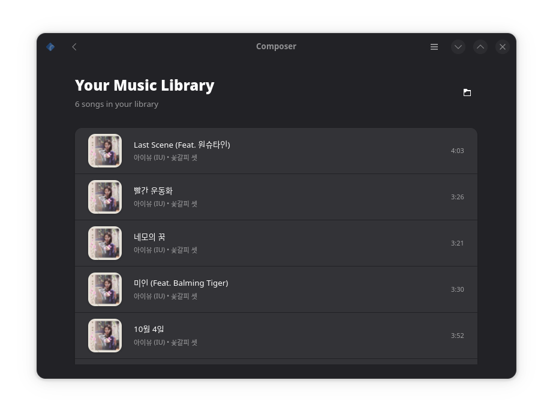

<h1 align="center">
  
  <br>
  Composer
</h1>

<p align="center">A modern GNOME application for discovering and downloading lyrics for your music collection.</p>

<p align="center">
  </a>
</p>

## 📖 About

Composer is a sleek GTK4/Adwaita application built for music lovers who want to enrich their listening experience. With its intuitive interface, you can effortlessly scan your music directories, explore track metadata, and seamlessly download lyrics file into your collection.

## 🎵 Features & Roadmap

### ✅ Completed
- **Directory scanning** - Discovers music files across your library.
- **Metadata extraction** - Displays song information including artist, album, duration, and more.

### 🚧 In Development
- **One-click lyric downloads** - Fetch lyrics for any track in your collection.
- **Bulk processing** - Download lyrics for entire libraries in one go.
- **Romanization** - Converts non-Latin scripts (Japanese, Korean, etc.) to readable Latin characters.

## 🏗️ Installation

### Quick Start with Meson

1. **Clone the repository:**
   ```bash
   git clone https://github.com/Gasiyu/Composer.git
   cd Composer
   ```

2. **Install dependencies:**
   ```bash
   pip3 install --user mutagen
   ```

3. **Build and install:**
   ```bash
   meson build
   ninja -C build install
   ```

4. **Launch Composer:**
   ```bash
   id.ngoding.Composer
   ```

### Sandboxed Installation with Flatpak

1. **Set up Flatpak** (if not already installed):
   - Install [Flatpak](https://flatpak.org/setup/) and [flatpak-builder](https://docs.flatpak.org/en/latest/flatpak-builder.html)

2. **Add GNOME runtime:**
   ```bash
   flatpak remote-add --user --if-not-exists flathub https://flathub.org/repo/flathub.flatpakrepo
   flatpak install --user flathub org.gnome.Platform//47 org.gnome.Sdk//47
   ```

3. **Build and install:**
   ```bash
   flatpak-builder build id.ngoding.Composer.json --user --install --force-clean
   ```

4. **Run the application:**
   ```bash
   flatpak run id.ngoding.Composer
   ```

## 📄 License

This project is licensed under the [GPL-3.0 License](COPYING). See the `COPYING` file for complete terms and conditions.